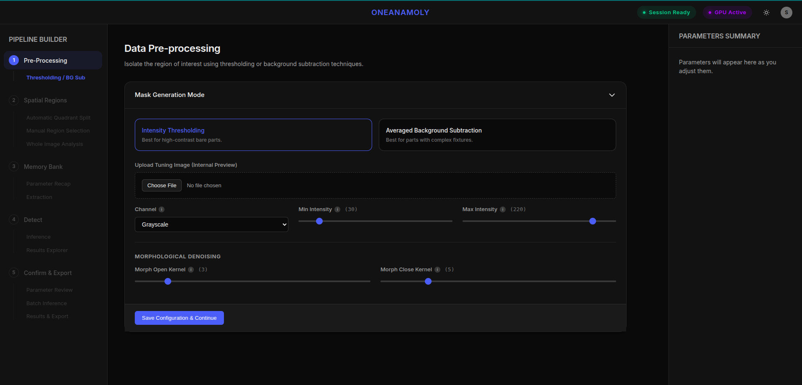
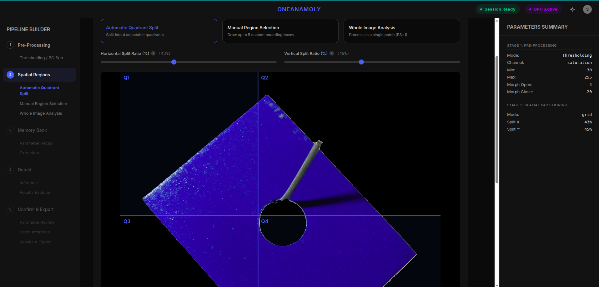
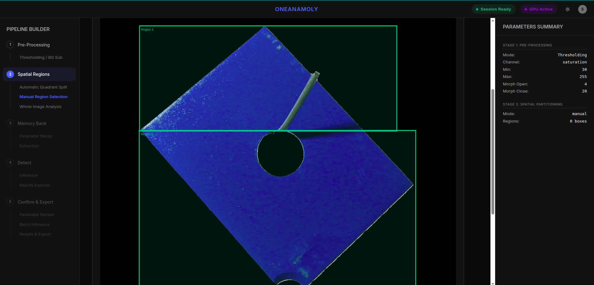
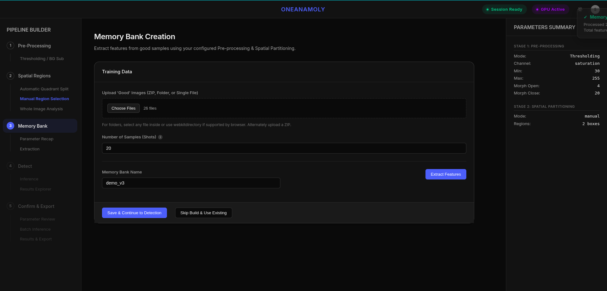
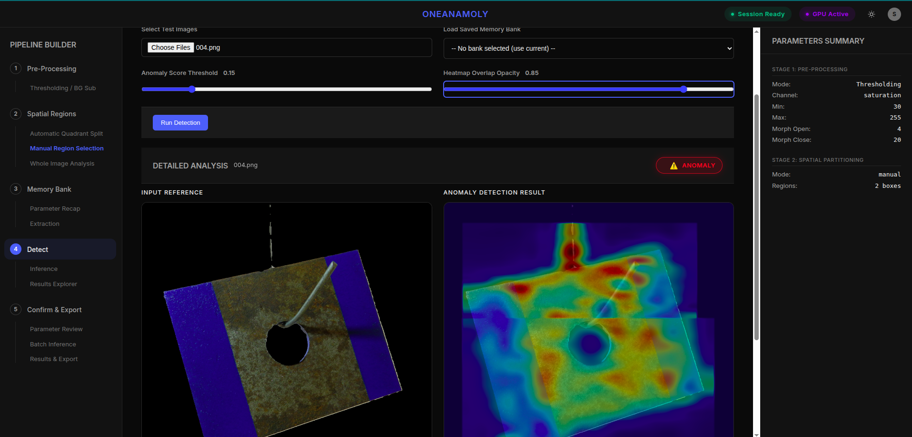
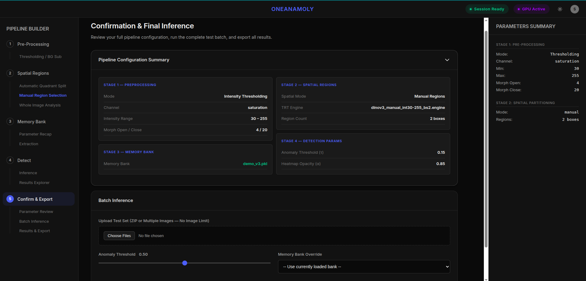
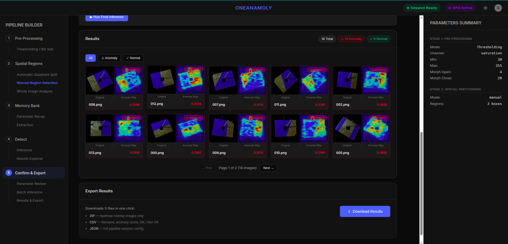

# OneAnomaly — DINOv3 Anomaly Detection Platform

A production-ready **web application** for detecting surface defects in industrial parts using Meta's **DINOv3 Vision Transformer**, **FAISS** similarity search, and **TensorRT** hardware-accelerated inference — all wrapped in a premium dark-mode interface.

---

## ✨ Features

- **5-Stage Guided Workflow** — Preprocessing → Spatial → Memory Bank → Detection → Confirmation & Export
- **Spatial Region Analysis** — Detect anomalies in specific zones (manual draw or auto quadrant)
- **TensorRT Acceleration** — Export DINOv3 ONNX → TRT engine in-browser with real-time progress
- **Memory Bank Management** — Save, load, and switch between named FAISS feature banks
- **Side-by-Side Batch Inspection** — Source image vs. JET heatmap overlay with adjustable opacity
- **Live Parameter Inspector** — Right-side panel tracking all session config in real time
- **Session Storage** — All result artifacts (`_source.png`, `_overlay.png`, etc.) persisted per run

---

## 🚀 Quick Start

### Prerequisites
- NVIDIA GPU with CUDA (required for TensorRT + FAISS-GPU)
- Python 3.8+
- TensorRT 8.x installed system-wide

### 1. Clone & Install Python Dependencies
```bash
pip install -r requirements.txt
```

### 2. Place Model Weights
```
anomaly_app/models/
└── dinov3_vits16_pretrain_lvd1689m.pth
```
See `docs/SETUP_DINOV3.md` for download instructions.

### 3. Start the Flask Server
```bash
cd python
python api_server.py
```

```bash
cd public
python3 -m http.server 8000
```

Open **http://localhost:8000** in your browser.

> **Note**: The Flask server serves both the frontend and the ML API. No Node.js server needed.

---

## 📖 Workflow

### Stage 1 — Preprocessing
Select **Intensity Thresholding** or **Averaged Background Subtraction**. Adjust sliders and watch the live preview grid update. Click **Save & Continue**.

 

 


### Stage 2 — Spatial Regions
Define inspection zones:
- **Manual Draw** — Click and drag to draw bounding boxes on a preview image
- **Quadrant Grid** — Automatic 2×2 split
- **No Split** — Full-image mode



Select a TensorRT engine matching your region count (batch size). Click **Export** to compile if needed.


### Stage 3 — Memory Bank
Upload good (defect-free) sample images as ZIP or multi-file. Click **Extract Features** to build the FAISS index, or **Skip & Use Existing** to load a previously saved bank.



### Stage 4 — Detection & Analysis
Upload a test image. The system preprocesses it → extracts features → searches the FAISS bank → generates heatmaps. Results appear in the **Detailed Analysis** view:

| Left Panel | Right Panel |
|---|---|
| Input Reference (`_source.png`) | Anomaly Detection Result (`_overlay.png`) |

Use the **Heatmap Alpha** slider to control overlay intensity. The **Anomaly Score** card and status badge update live as you adjust the threshold.






---

## 🗂️ Project Structure

```
anomaly_app/
├── public/                   # Frontend (HTML/CSS/JS)
│   ├── index.html
│   ├── style.css
│   └── app.js
├── python/                   # ML backend
│   ├── api_server.py         # Flask API (all endpoints)
│   ├── feature_extractor.py  # DINOv3 TRT/PyTorch extraction
│   ├── memory_bank.py        # MemoryBank + SpatialMemoryBank (FAISS)
│   ├── anomaly_detector.py   # Heatmap generation & file saving
│   ├── dinov3/               # DINOv3 repo (submodule)
│   ├── src/                  # Preprocessing test scripts
│   └── requirements.txt
├── models/
│   ├── dinov3_vits16_pretrain_lvd1689m.pth
│   └── engine_files/         # Compiled TRT engines
├── memory_banks/             # Saved FAISS banks (.pkl)
├── outputs/sessions/         # Per-run detection results
├── uploads/                  # Temporary upload storage
└── docs/                     # Project documentation
```

---

## 🛠️ Tech Stack

| Component | Technology |
|---|---|
| Frontend | HTML5, CSS3, Vanilla JS |
| API Server | Python / Flask / Flask-CORS |
| Feature Extraction | DINOv3 ViT-S/16 (TensorRT / PyTorch fallback) |
| Similarity Search | FAISS-GPU (IndexFlatIP — cosine similarity) |
| Image Processing | OpenCV, scipy (gaussian filter) |
| Heatmap | JET colormap via `cv2.applyColorMap` |

---
